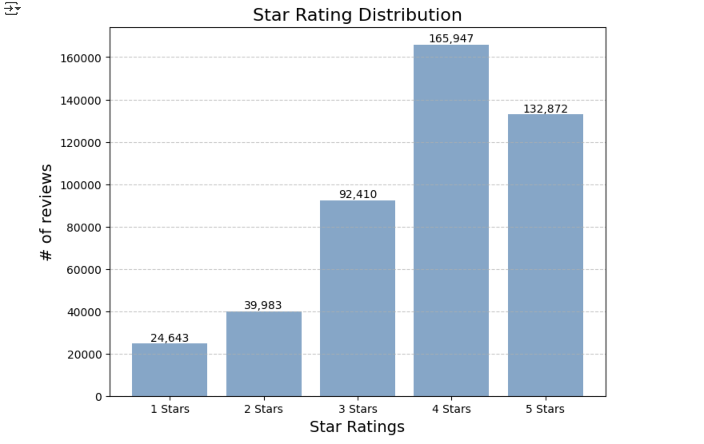
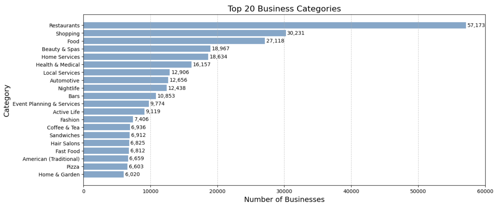
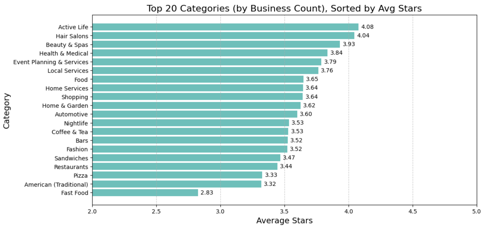
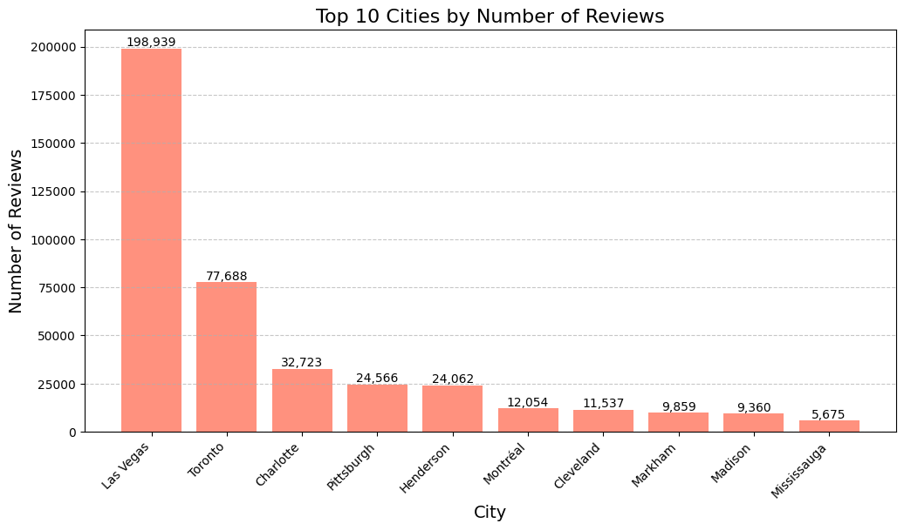
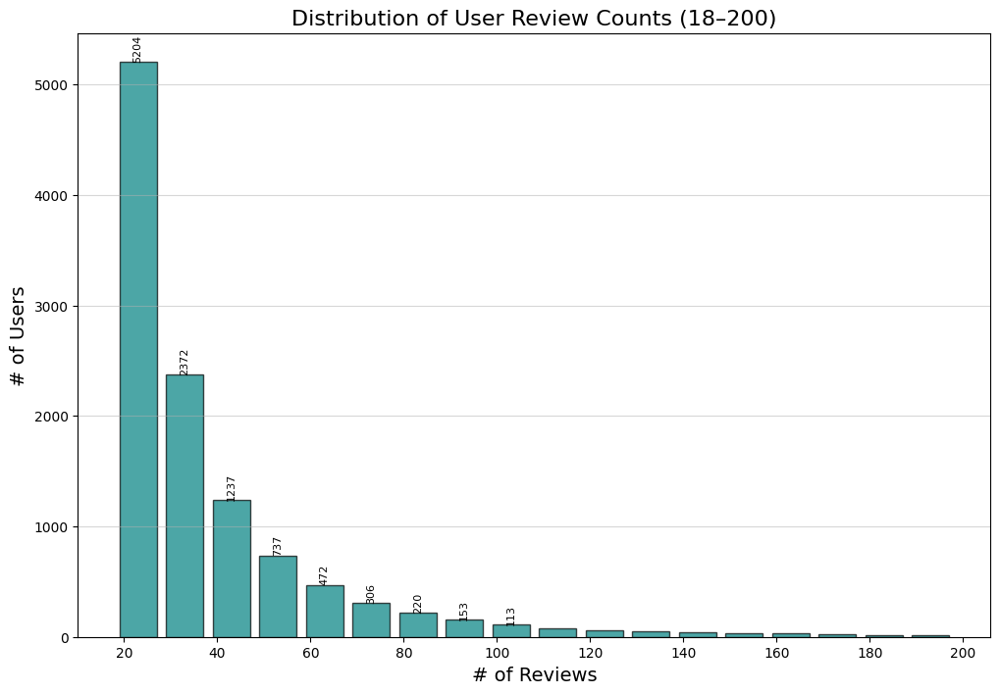

# Full stack Yelp Rating Prediction and Recommendation Project

##  1. Overview
This project addresses two core business problems:

1. Rating Prediction: Given detailed datasets on users and businesses, how can we accurately predict a user’s rating for a specific business?

2. Personalized Recommendation: Based on these predicted ratings, how can we recommend the most relevant businesses to each user?

To solve these problems, we developed a hybrid recommendation system that combines XGBoost regression with item-based collaborative filtering. The system is deployed as a live Flask web app with two main API endpoints: one for predicting ratings and one for generating top-K recommendations. 
### Live web application demo: [](https://yelp-demo-379273568378.us-central1.run.app/).


### Getting Started
For setup instructions and usage examples, refer to [README.md](README.md).


---
##  2. Stakeholder Perspective 
This project is grounded in the needs of three key stakeholders on the Yelp platform:

*  Platform Operators
Boost engagement and retention with personalized recommendations and smarter platform design.

* Users (reviewers and browsers)
Get accurate suggestions aligned with preferences, reducing decision fatigue and improving satisfaction.

* Businesses
Reach the right customers through targeted visibility, driving acquisition and engagement.


---


## 3. Dataset Description
- **Source**: Yelp Open Dataset  
This project leverages multiple structured datasets derived from Yelp’s public data release. The data reflects real user-business interactions across multiple U.S. and Canadian cities, and is ideal for analyzing consumer behavior, business reputation, and social dynamics on a local platform.

We focus on the following five core datasets:
- **Files Used**:
  - `yelp_train.csv`: training set containing user reviews and ratings
  - `yelp_val.csv`: validation set used to evaluate model performance 
  - `business.json`: Metadata of businesses including name, category, location, star rating, and review count
  - `user.json`: User profile information includes review count, average rating, elite status, compliment counts, and reactions such as useful, funny, and cool.
  - `photo.json`: photo posts include information such as business ID, user ID, label, caption, and more.  
- **Size**: ~3 GB (millions of reviews, thousands of users and businesses)  
- **Target Variable**: `stars` (user rating: 1–5)  

---

##  4. Exploratory Data Analysis (EDA)

The training dataset consists of 455,855 reviews from 11,270 users across 24,732 businesses.
### 4.1 Business Rating Distribution
To understand the overall landscape of business ratings on Yelp, we first visualize the distribution of star ratings (1.0 to 5.0) across all businesses. 
Using the stars field in yelp_train.csv, we calculate frequency and proportion of each rating level, and render a bar chart with annotated counts.



### Insights
- The distribution is skewed toward positive reviews, with most ratings being 4 or 5 stars.  
- Low-star reviews (1–2 stars) are underrepresented, creating class imbalance.  
- Neutral ratings (3 stars) are more common than very negative ones, suggesting users prefer moderate feedback over harsh criticism.  


### 4.2 Top Business Categories by Business Count
To identify the dominant business types on Yelp and understand the service landscape users interact with, we analyze the frequency of business categories.

Each business on Yelp can belong to multiple categories (e.g., "Restaurants; Bars; Nightlife"). We split the categories field and compute the most common tags across all businesses.




### Insights
- Restaurants, Shopping, and Food dominate the list, jointly accounting for over 60% of all business tags.  
- Service industries like Beauty & Spas, Health & Medical, and Home Services form the second tier.  
- Nightlife-related categories (Bars, Clubs) are present but not dominant, highlighting Yelp’s primary focus on daily services over leisure sectors.  

### Modeling Implications
- The dominance of food and shopping categories may bias models toward these domains, requiring careful feature balancing.  
- Category-level embeddings or one-hot encodings could help the model capture industry-specific patterns.  
- Niche categories with fewer samples may suffer from sparse representation, making them harder to predict accurately without smoothing or hierarchical grouping.  


### 4.3 Top Business Categories by AVG Stars
To understand how customer satisfaction varies across industries, we analyze Yelp business categories and compute their average star ratings.  
Since each business can belong to multiple categories (e.g., "Restaurants; Bars; Nightlife"), we split the category field and calculate the mean rating for each category.  




### Insights
- Active Life and Hair Salons receive the highest average ratings (~4.0), reflecting strong customer satisfaction.  
- Personal care and wellness services (Beauty & Spas, Health & Medical) also rank above average.  
- Food-related categories (Restaurants, Pizza, Fast Food) tend to have lower ratings, with Fast Food at the bottom (2.83).  

### Modeling Implications
- Business category is a strong predictive feature and should be incorporated into the model.  
- Sectoral bias in ratings (e.g., consistently low scores in Fast Food) may require normalization or category embeddings to avoid skewed predictions.  


### 4.4 Top 10 cities by Number of Reviews
We joined the training reviews (`yelp_train.csv`) with business metadata (`business.json`) on `business_id` to retrieve the city for each business. The total reviews were then aggregated by city to identify the top 10 locations with the highest review activity. 




### Insights
- Las Vegas dominates with nearly 200K reviews, far more than any other city.  
- Review activity is highly concentrated in a few metro areas, with most other cities contributing far fewer reviews.  
  

 ### 4.5 Distribution of User Review Counts
We computed each user’s actual review count by joining review_train.json with user.json, then filtered counts between 18 and 200 and plotted a histogram (bin size = 10) to visualize the distribution of user review activity.





### Summary Statistics
- Mean review count: **40.45**  
- Median review count: **29.0**  
- Mode review count: **19**  

### Insights
- The distribution is heavily right-skewed: most users contribute only a small number of reviews, while a few write substantially more.  
- The median (29) is lower than the mean (40), confirming the presence of highly active “super-reviewers.”  
- The mode at 19 shows that small but consistent contributors dominate Yelp activity.  

### Modeling Implications
- User activity level should be included as a feature, since prolific reviewers may have different rating behaviors from casual users.  
- The imbalance between super-reviewers and typical users could bias models; normalization or log-scaling of review counts can help mitigate this effect.  


---

##  5. Feature Engineering 
We engineered features from multiple sources to capture both user behavior and business characteristics.

**User Features**
- Average star rating, review count, usefulness, funny, cool votes  
- Activity ratios:  
  - `user_bus_rating_diff = user_avg_star – bus_stars`  
  - `user_bus_rating_ratio = user_avg_star / (bus_stars + 0.1)`  
  - `user_activity_ratio = user_review_cnt / (user_useful + 1)`

**Business Features**
- Baseline: stars, review count, photo count, operation days, price range  
- Categorical attributes (one-hot encoded with `drop_first`): credit card acceptance, open status, validated parking, noise level, delivery, takeout, wifi, table service, wheelchair accessibility  
- String attributes like `"True"` normalized to integers before encoding  

**Collaborative Filtering Dictionaries**
- `business_user_rating_dict` → {user: rating} per business  
- `business_avg_rating` → average stars per business  
- `user_avg_dict` → average stars per user  
- `global_avg` → global mean rating  
- Precomputed item similarities (`item_topk`) using squared Pearson correlation across co-raters (min 20), used for candidate generation


---

## 6. Hybrid Recommendation System: Predicting Ratings for a Given User and Business

A hybrid recommendation system that combines XGBoost machine learning with Collaborative Filtering using linear combination to predict Yelp business ratings.

**Final Rating = α × XGBoost + (1 – α) × Collaborative Filtering**

### XGBoost Component
- Learns from user and business features  
- Handles cold start cases  
- Captures non-linear feature interactions  

### Collaborative Filtering Component
- Item-based CF using squared Pearson similarity with ≥20 co-raters  
- Precomputes top-50 similar businesses for each item  
- Candidate pool capped at 300 for efficiency  
- Cold start fallback: recommend top businesses by average rating  


### Combination Strategy
- New users or businesses → α = 0.8 (heavier XGBoost)  
- Experienced users → α = 0.6 (balanced mix)  

### Why Hybrid Works
- XGBoost brings robustness to feature-rich and cold start scenarios  
- CF captures community preference patterns  
- The combination reduces weaknesses of individual models


### Cold Start Handling
**New Users**  
- XGBoost applies default user features such as average rating = 3.0 and review count = 0  
- CF falls back to recommending top businesses ranked by overall average rating  
- Linear combination ensures reasonable predictions even without user history  

**New Businesses**  
- XGBoost leverages business metadata such as price range, operation days, and amenities immediately  
- Default values are applied when attributes are missing (e.g., stars = 3.5, operation_days = 7)  
- Unlike pure CF, no waiting period is required for rating accumulation, enabling recommendations for new items from the start  


### Example Output

**Input**  
User ID: U12345  
Business ID: B67890  

**Predicted Rating**  
Final Rating = 0.8 × XGBoost + 0.2 × CF  
= 4.32  

**Breakdown**  
- XGBoost Prediction: 4.10  
- Collaborative Filtering Prediction: 5.00  
- Combined Final Rating: 4.32


## 7. Recommendation: Top-N for a User

After training the hybrid model, we extend it to generate personalized business recommendations. Given a user ID, the system ranks candidate businesses and returns the top-k (e.g., top 10) with the highest predicted ratings.

### Overview
1) Candidate generation  
Item-based collaborative filtering uses a precomputed similarity map `item_topk`.  
For every business a user has rated, take its top-50 similar items and merge into a de-duplicated candidate pool, capped at 300.  
If the user has no history, fall back to globally high-average-rating businesses.

2) Candidate scoring  
For each candidate, call `predict_for_user_business(user_id, business_id)` to build the exact same feature vector used at train time and score it with XGBoost.  
If using the hybrid formula, compute `Final = α × XGBoost + (1 − α) × CF`, where the CF score is a neighborhood-weighted average.  
Clamp predictions to the 1–5 range for interpretability.

3) Ranking and truncation  
Sort candidates by predicted score and return the top-k.  
Optional tie-breakers: `business_avg_rating`, then `review_count_bus`.

### Cold start
User cold start  
When no ratings exist, use global top businesses as candidates. 

### Key components
`precompute_item_similarities(topk=50, min_cousers=20)`  
Computes squared Pearson similarity over co-raters, filters pairs below the co-rater threshold, and persists `item_topk`.  
`get_candidates_for_user(user_id, per_item_k=20, max_pool=300)`  
Aggregates similar items from the user’s history into a bounded candidate pool.  
`predict_for_user_business`  
Constructs features online with the same transformations and column order as training to ensure schema parity.  
`recommend_for_user(user_id, k=10)`  
Scores, ranks, and returns the final top-k list including `business_id`, `business_name`, and `predicted_rating`.

### Complexity and efficiency
Item similarities are computed offline. Online latency is dominated by candidate count and model inference. The pool cap and `per_item_k` provide direct knobs for latency–quality trade-offs.

### Example output
```json
{
  "user_id": "U123",
  "user_name": "Alice",
  "recommendations": [
    { "business_id": "B1", "business_name": "Cafe Rio",  "predicted_rating": 4.72 },
    { "business_id": "B2", "business_name": "Sushi Zen", "predicted_rating": 4.65 },
    { "business_id": "B3", "business_name": "Burger Hub","predicted_rating": 4.58 }
  ]
}
```


-- 

## 8. Model Evaluation
- **Linear Regression**: Using the same features as below
- **Collaborative Filtering**: item-based 
- **Feature-Based Regression**: XGBoost using user and business features  
- **Hybrid Model**: Combined predictions from both XGBoost and CF

---

## 📊 Results
| Model                  | RMSE   |   
|-------------------------|--------|
| Linear Regression       | 1.2    | 
| Collaborative Filtering | 1.0    | 
| XGBoost Regression      | 0.983  | 
| Hybrid Model            | 0.979  | 

### Hybrid Model Performance
- **RMSE:** 0.979881  
- **Error Distribution:**  
  - 0–1: 102,260 (71.99%)  
  - 1–2: 32,792 (23.09%)  
  - 2–3: 6,162 (4.34%)  
  - 3–4: 830 (0.58%)  
  - 4+: 0 (0.00%)  

### Baseline (Linear Regression) Performance
- **RMSE:** 1.20  
- **Error Distribution:**  
  - 0–1: 101,165 (70.22%)  
  - 1–2: 33,721 (21.88%)  
  - 2–3: 6,324 (6.38%)  
  - 3–4: 731 (0.51%)  
  - 4+: 3 (0.00%)  

### Key Takeaways
- The **Hybrid Model** achieved the best performance, reducing RMSE from 1.20 (baseline) to **0.98**, an improvement of ~18%.  
- High accuracy: **95% of predictions fall within two stars** of the ground truth, and **over 70% within one star**.  
- Error balance: Virtually no cases exceed a 4-star error.  
- Efficiency: End-to-end runtime is under **75 seconds**, demonstrating scalability for large datasets.  

### Interpretation of RMSE = 0.979
The RMSE score of **0.979** means that, on average, the model’s predicted ratings deviate from the true Yelp ratings by **less than one star** on the 1–5 scale.  
- A perfect RMSE would be 0, meaning predictions are always exact.  
- An RMSE close to 1.0 indicates the system is highly reliable, since most users would not perceive a difference of under one star as significant in real-world recommendation settings.  
- This level of accuracy is strong for recommender systems, where noisy human ratings and diverse user preferences make exact prediction difficult.  
---


## 9. Lightweight Serving: Flask API + Web Demo

This repo includes a minimal serving stack to demo both **rating prediction** and **top-K recommendations**. This project can be run locally or via Docker. For complete Quickstart and API cURL examples, see the repository README.

### Server Overview
- **Framework**: Flask
- **Model loading**: Pickled XGBoost (`model/yelp_model.pkl`)
- **Data layer**: Spark for feature prep; precomputed CF artifacts (optional) under `model/recommender_business/`
- **Frontend**: Single Bootstrap page (`index.html`) with two tabs:
  - **Predict**: given `(user_id, business_id)` ⇒ predicted rating
  - **Recommend**: given `user_id` ⇒ top-K businesses with predicted scores

### Endpoints
- `GET /`  
  Renders the demo UI. Prefills example `user_id` and `business_id` pairs from `yelp_val.csv`.
- `GET /health`  
  Health probe with `model_loaded` and `cf_available` flags.
- `POST /api/predict`  
  JSON: `{"user_id": "...", "business_id": "..."}`  
  Returns: predicted rating, optional ground-truth if present in `yelp_val.csv`.
- `POST /api/recommend`  
  JSON: `{"user_id": "...", "k": 10}`  
  Returns: top-K recommendations with `business_id`, `business_name`, `city`, `state`, and `predicted_rating`.


## 10. Conclusion  

- Built a scalable hybrid recommendation system for Yelp that integrates machine learning (XGBoost) and collaborative filtering.  
- Achieved significant improvement over baseline models with strong predictive accuracy and efficient runtime.  

### Future Work  
- **Feature enrichment**: Incorporate business metadata such as categories, geolocation, and temporal patterns (e.g., time-of-day or seasonal trends).  
- **Cold start robustness**: Enhance strategies for new users and businesses by leveraging location-based popularity, demographic clustering, or content-based filtering.  
- **User segmentation**: Apply clustering or embedding-based techniques to better capture diverse user behavior and preferences.  
- **Explainability**: Provide interpretable recommendations by highlighting which features (e.g., price range, reviews, or amenities) influenced predictions.  
- **Scalability**: Deploy on distributed systems (Spark MLlib, AWS EMR, or Kubernetes) to handle larger datasets and real-time inference.  
- **A/B testing**: Validate recommendation performance in a live environment by measuring user engagement and satisfaction.  


---
